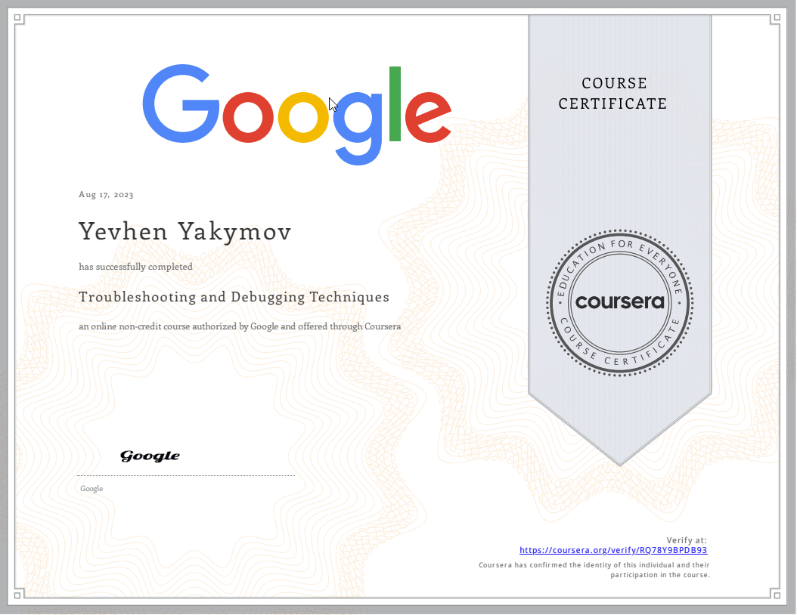

# Troubleshooting and Debugging Techniques

**by Google**

## About this Course

In this course, we'll give you the tools to quickly identify and solve real-world problems that you might come across\
in your IT role. We'll look at a bunch of different strategies and approaches for tackling the most common pitfalls\
of your code and IT infrastructure. You'll learn strategies for approaching almost any technical problem and then see\
how those apply to solving different real-world scenarios.

We picked examples that include general system issues, issues with software that someone else wrote, and issues with\
programs that we wrote. We'll talk about problems that can affect any operating system, and we'll also look\
at challenges specific to certain platforms and scripting languages.

We strongly recommend that you’ve taken the prior courses in this program, or already have knowledge of Python and Linux\
so that you can follow along with our troubleshooting examples.

## Certificate

