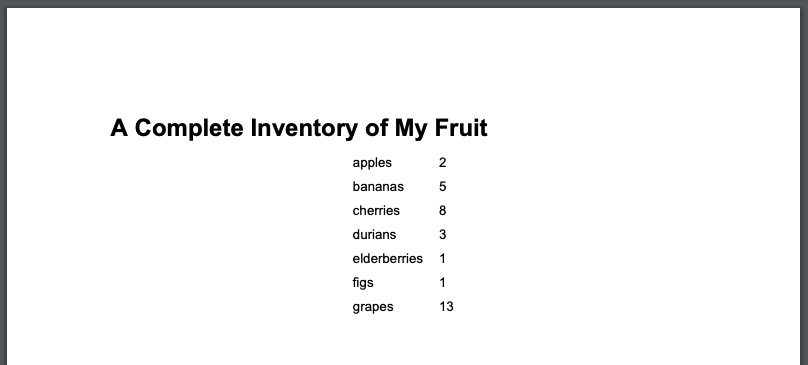
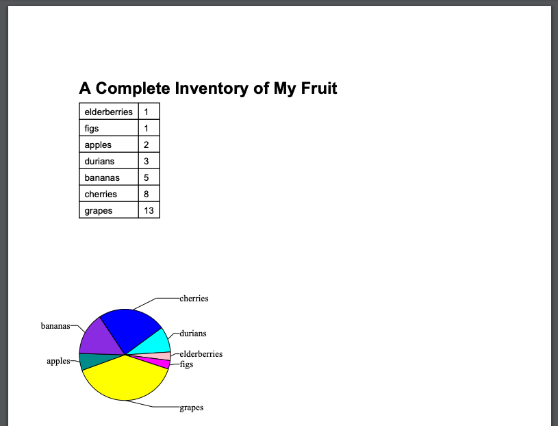

# Generating PDFs from Python

## Introduction to Generating PDFs

Depending on what your automation does, you might want to generate a PDF report at the end, which lets you decide exactly\
how you want your information to look like. There's a few tools in Python that let you generate PDFs with the content that\
you want. Here, we'll learn about one of them:[ReportLab](https://www.reportlab.com/opensource/). ReportLab has a **lot** of different features for creating PDF\ documents. We'll cover just the basics here, and give you pointers for more information at the end.

For our examples, we'll be mostly using the high-level classes and methods in the ***Page Layout and Typography Using Scripts***\ (PLATYPUS) part of the ReportLab module.

Let's say that I have an awesome collection of fruit, and I want to create a PDF report of all the different kinds of\
fruit I have! I can easily represent the different kinds of fruit and how much of each I have with a Python dictionary.\
It might look something like this:

```Python
fruit = {
  "elderberries": 1,
  "figs": 1,
  "apples": 2,
  "durians": 3,
  "bananas": 5,
  "cherries": 8,
  "grapes": 13
}
```

Now let's take this information and turn it into a report that we can show off! We're going to use the **SimpleDocTemplate**\ class to build our PDF.

```Python
>>> from reportlab.platypus import SimpleDocTemplate
>>> report = SimpleDocTemplate("/tmp/report.pdf")
```

The **report** object that we just created will end up generating a PDF using the filename **/tmp/report.pdf**. Now, let's\
add some content to it! We'll create a title, some text in paragraphs, and some charts and images. For that, we're going\
to use what reportlab calls ***Flowables***. Flowables are sort of like chunks of a document that reportlab can arrange to\
make a complete report. Let's import some Flowable classes.

```Python
>>> from reportlab.lib.styles import getSampleStyleSheet
>>> styles = getSampleStyleSheet()
```

Each of these items (**Paragraph, Spacer, Table**, and **Image**) are classes that build individual elements in the final\
document. We have to tell reportlab what ***style*** we want each part of the document to have, so let's import some more\
things from the module to describe style.

```Python
>>> from reportlab.platypus import Paragraph, Spacer, Table, Image
```

You can make a style all of your own, but we’ll use the default provided by the module for these examples. The **styles**\
object now contains a default "sample" style. It’s like a dictionary of different style settings. If you've ever written\
HTML, the style settings will look familiar. For example **h1** represents the style for the first level of headers.\
Alright, we're finally ready to give this report a title!

```Python
>>> report_title = Paragraph("A Complete Inventory of My Fruit", styles["h1"])
```

Let's take a look at what this will look like. We can build the PDF now by using the **build()** method of our report.\
It takes a list of Flowable elements, and generates a PDF with them.

```Python
>>> report.build([report_title])
```

Okay, now let's take a look at the PDF:


It's not much, but it's a start!

Up next, we'll look into an interesting Flowable for our reports: Tables.

## Adding Tables to our PDFs

Up to now, we've generated an extra simple PDF file, that just includes a title.

Let's spice this up by adding a ***Table***. To make a Table object, we need our data to be in a ***list-of-lists***, sometimes called\
a ***two-dimensional array***. We have our inventory of fruit in a dictionary. How can we convert a dictionary into a list-of-\
lists?

```Python
>>> table_data = []
>>> for k, v in fruit.items():
...   table_data.append([k, v])
...
>>> print(table_data)
[['elderberries', 1], ['figs', 1], ['apples', 2], ['durians', 3], ['bananas', 5], ['cherries', 8], ['grapes', 13]]
```

Great, we have the list of lists. We can now add it to our report and then generate the PDF file once again by calling the\ **build** method.

```Python
>>> report_table = Table(data=table_data)
>>> report.build([report_title, report_table])
```

And this is how the generated report looks now:



Okay, it worked! It's not very easy to read, though. Maybe we should add some style to **report_table**. For our example,\
we'll add a border around all of the cells in our table, and move the table over to the left. ***TableStyle*** definitions can\
get pretty complicated, so feel free to take a look at the documentation for a more complete idea of what’s possible.

```Python
>>> from reportlab.lib import colors
>>> table_style = [('GRID', (0,0), (-1,-1), 1, colors.black)]
>>> report_table = Table(data=table_data, style=table_style, hAlign="LEFT")
>>> report.build([report_title, report_table])
```


Much better! Up next, we'll look into making this more colorful by adding graphs to our reports.

## Adding Graphics to our PDFs

Up to now, we've generated a report with a title and a table of data. Next let's add something a little more graphical.\
What could be better than a fruit pie (graph)?! We’re going to need to use the **Drawing** Flowable class to create a **Pie chart**.

```Python
>>> from reportlab.graphics.shapes import Drawing
>>> from reportlab.graphics.charts.piecharts import Pie
>>> report_pie = Pie(width=3*inch, height=3*inch)
```

To add data to our **Pie** chart, we need two separate lists: One for data, and one for labels. Once more, we’re going\
to have to transform our fruit dictionary into a different shape. For an added twist, let's sort the fruit in\
alphabetical order:

```Python
>>> report_pie.data = []
>>> report_pie.labels = []
>>> for fruit_name in sorted(fruit):
...   report_pie.data.append(fruit[fruit_name])
...   report_pie.labels.append(fruit_name)
...
>>> print(report_pie.data)
[2, 5, 8, 3, 1, 1, 13]
>>> print(report_pie.labels)
['apples', 'bananas', 'cherries', 'durians', 'elderberries', 'figs', 'grapes']
```

The Pie object isn’t Flowable, but it can be placed inside of a Flowable Drawing.

```Python
>>> report_chart = Drawing()
>>> report_chart.add(report_pie)
```

Now, we'll add the new Drawing to the report, and see what it looks like.

```Python
report.build([report_title, report_table, report_chart])
```



Alright, and with that, you've seen a few examples of what we can do with the ReportLab library.  There's a ton more\
things that can be done that we won't cover here. You'll want to refer to the [ReportLab User Guide](https://www.reportlab.com/docs/reportlab-userguide.pdf) for more details\
on the features we've seen, and to see what else you can create with it.

By the way, the ReportLab User Guide is a PDF that is generated using reportlab! Cool, right?