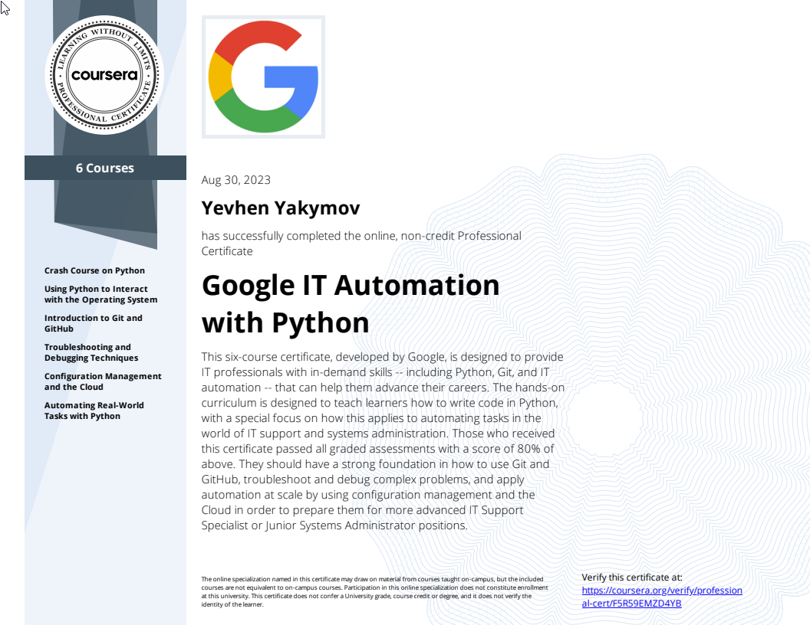

# Google IT Automation with Python Professional Course

## Intro

The main purpose of creating this repository is self-study during the [Google IT Automation with Python Professional Course](https://www.coursera.org/professional-certificates/google-it-automation)\
by Google on [Coursera](https://www.coursera.org/). Here you will find training materials, files, videos, quizes and scripts for all 6 courses.

## Certificate

## About course

**What you'll learn**

> - [x] Automate tasks by writing Python scripts
> - [x] Use Git and GitHub for version control
> - [x] Manage IT resources at scale, both for physical machines and virtual machines in the cloud
> - [x] Analyze real-world IT problems and implement the appropriate strategies to solve those problems

This beginner-level, six-course certificate, developed by Google, is designed to provide IT professionals with\
in-demand skills -- including Python, Git, and IT automation -- that can help you advance your career.

Knowing how to write code to solve problems and automate solutions is a crucial skill for anybody in IT.\
Python, in particular, is now the [most in-demand programming language by employers](https://insights.dice.com/2019/10/08/python-java-top-languages-employers/).

This program builds on your IT foundations to help you take your career to the next level. It’s designed to teach\
you how to program with Python and how to use Python to automate common system administration tasks. You'll also\
learn to use Git and GitHub, troubleshoot and debug complex problems, and apply automation at scale by using\
configuration management and the Cloud.

This certificate can be completed in about 6 months and is designed to prepare you for a variety of roles in IT,\
like more advanced IT Support Specialist or Junior Systems Administrator positions. Upon completion, you can share\
your information with potential employers, like Deloitte, Target, Verizon, and of course, Google.

We recommend that you have Python installed on your machine. For some courses, you’ll need a computer where you can\
install Git or ask your administrator to install it for you.

If you’d like to learn the fundamentals of IT support, check out the beginner level\
[Google IT Support Professional Certificate](https://www.coursera.org/professional-certificates/google-it-support).

Check out all Google Career Certificates [here](https://www.coursera.org/google-career-certificates).

Applied Learning Project

Learn how to program with Python with no previous knowledge of coding required and you’ll use Python to automate\
common system administration tasks

Learn to use Git and GitHub, to troubleshoot and debug complex problems

Apply automation at scale by using configuration management and the Cloud

Practice your technical skills with hands-on projects including a capstone project where you’ll use your new\
knowledge to solve a real-world IT problem.

## 6 course series

> - [Crash Course on Python](01_Crash%20Course%20on%20Python)
> - [Using Python to Interact with the Operating System](02_Using%20Python%20to%20Interact%20with%20the%20Operating%20System)
> - [Introduction to Git and GitHub](03_Introduction%20to%20Git%20and%20GitHub)
> - [Troubleshooting and Debugging Techniques](04_Troubleshooting%20and%20Debugging%20Techniques)
> - [Configuration Management and the Cloud](05_Configuration%20Management%20and%20the%20Cloud)
> - [Automating Real-World Tasks with Python](06_Automating%20Real-World%20Tasks%20with%20Python)